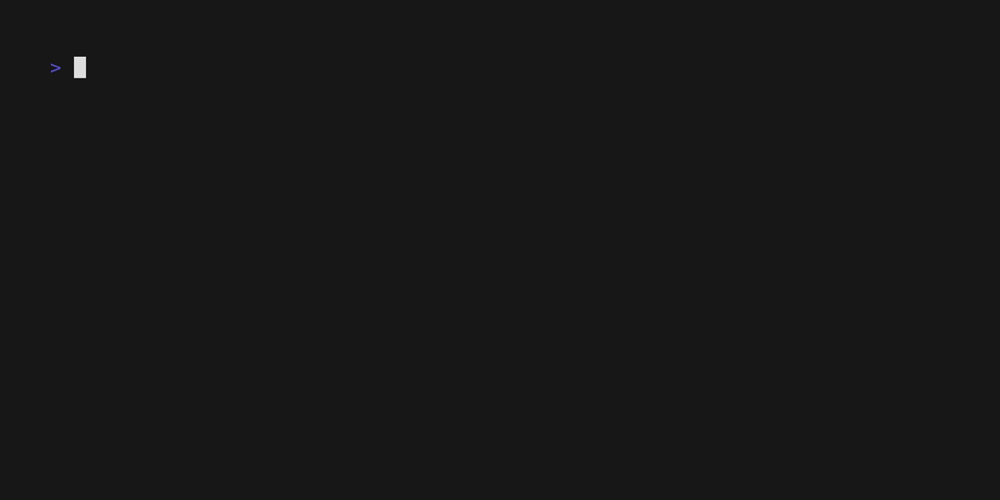

# roblox-chcker

<p align="center">
  
</p>

<p align="center">
    <i>Roblox tools :)</i>
</p>

## Usage

Install packages:

```bash
bun i
```

Run:

```bash
bun run index.ts
```



---

_© 2024 Kieran Klukas_  
_Licensed under [AGPL 3.0](LICENSE.md)_  